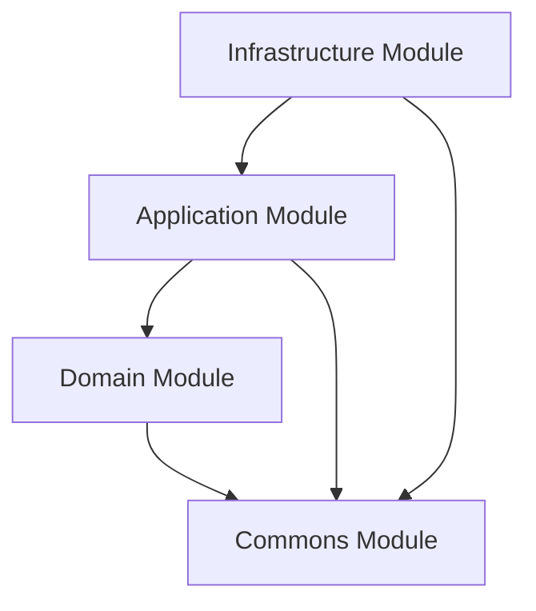
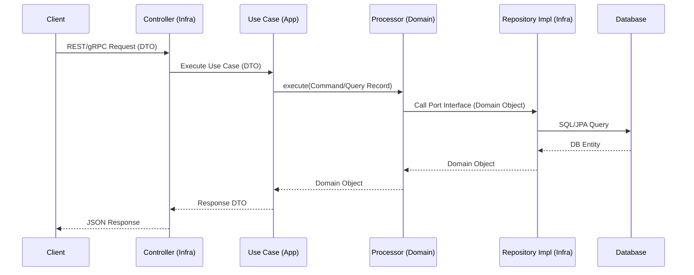

# 🚀 BCK-Plantilla: Microservices Base Template

[](https://sonarcloud.io/summary/new_code?id=DvC99_bck-plantilla-micro-java)

**BCK-Plantilla** is a high-performance, production-ready base template for microservices developed by **Sysman**. It
implements a **Pragmatic Hexagonal Architecture** combined with **Domain-Driven Design (DDD)** and **CQRS (Command Query
Responsibility Segregation)** to ensure scalability, maintainability, and strict separation of concerns.

---

## 🛠️ Tech Stack

| Component         | Technology        | Version  |
|:------------------|:------------------|:---------|
| **Language**      | Java              | 25 (LTS) |
| **Framework**     | Spring Boot       | 4.0.0    |
| **Core**          | Spring Framework  | 7.0.1    |
| **Database**      | PostgreSQL        | 14+      |
| **Messaging**     | Apache Kafka      | 3.3.1    |
| **RPC**           | gRPC              | 1.63.0   |
| **Build Tool**    | Gradle            | 9.x      |
| **Documentation** | OpenAPI / Swagger | 2.7.0    |

---

## 🏗️ Architecture

The project follows a **Pragmatic Hexagonal Architecture**. The core principle is the **Dependency Rule**: dependencies
only point inwards.

### 📦 Module Structure

- **`domain`**: The heart of the software. Contains business entities, domain services (annotated with `@DomainService`), and ports (interfaces). Lombok is permitted; no Spring annotations.
- **`application`**: The orchestrator. Contains Use Cases, DTOs, and Mappers. Coordinates data flow between domain and infrastructure.
- **`infrastructure`**: The technical detail. Contains database adapters (JPA), external API clients, gRPC/REST
  controllers, and the `MainApplication` bootstrap. `DomainServicesBeanRegistrar` auto-registers domain services.
- **`commons`**: Shared cross-cutting utilities and base classes: `GenericServiceImpl`, CQRS abstracts, `IRepository`, response builders, exceptions.

### 📉 Dependency Flow



### 🔄 Request Lifecycle



---

## 🚀 Getting Started

### Prerequisites

- **JDK 25**
- **PostgreSQL** (or a Supabase project)
- **Apache Kafka** (optional in `dev` profile — disabled by default)

### 1. Configure environment variables

All sensitive credentials are read from a `.env` file at the project root. This file is **never committed** to source
control (it is listed in `.gitignore`).

Copy the provided template and fill in your values:

```bash
cp .env.example .env
```

Then edit `.env` with your actual credentials:

```dotenv
# ── Server ────────────────────────────────────────────────────
SERVER_PORT=8081
GRPC_SERVER_PORT=9091

# ── Command datasource (write) ────────────────────────────────
SPRING_DATASOURCE_COMMAND_URL=jdbc:postgresql://<host>:<port>/<db>?reWriteBatchedInserts=true
SPRING_DATASOURCE_COMMAND_USERNAME=<username>
SPRING_DATASOURCE_COMMAND_PASSWORD=<password>

# ── Query datasource (read) ───────────────────────────────────
SPRING_DATASOURCE_QUERY_URL=jdbc:postgresql://<host>:<port>/<db>?reWriteBatchedInserts=true
SPRING_DATASOURCE_QUERY_USERNAME=<username>
SPRING_DATASOURCE_QUERY_PASSWORD=<password>

# ── Kafka (optional — disabled in dev by default) ─────────────
SPRING_KAFKA_BOOTSTRAP_SERVERS=localhost:9092

# ── CORS ──────────────────────────────────────────────────────
CORS_ALLOWED_ORIGINS=http://localhost:4200

# ── REST microservice URLs (optional) ────────────────────────
MICROSERVICE_AUDIT_URL=
MICROSERVICE_AUTH_URL=
MICROSERVICE_UTILITY_URL=

# ── gRPC microservice URLs (optional) ────────────────────────
GRPCSERVICE_AUDIT_URL=
GRPCSERVICE_AUTH_URL=
GRPCSERVICE_UTILITY_URL=

# ── Email (optional) ──────────────────────────────────────────
SPRING_MAIL_HOST=smtp.gmail.com
SPRING_MAIL_PORT=587
SPRING_MAIL_USERNAME=
SPRING_MAIL_PASSWORD=
SPRING_MAIL_SMTP_AUTH=true
SPRING_MAIL_SMTP_STARTTLS_ENABLE=true

# ── SonarQube ──────────────────────────────────────────────────
SONAR_TOKEN=

# ── OCI Object Storage (optional) ────────────────────────────
OCI_CONFIG_PROFILE=default
OCI_OBJECTSTORAGE_BUCKET=
OCI_OBJECTSTORAGE_NAMESPACE=
OCI_TENANCY=
OCI_USER=
OCI_FINGERPRINT=
OCI_REGION=
OCI_PEM=
```

> **Note:** The dual datasource (`COMMAND` / `QUERY`) can point to the same database instance during development.
> Kafka is disabled by default in the `dev` profile (`app.messaging.kafka.enabled=false`), so no broker is required
> to start the application locally.

### 2. Install GitHub CLI

```bash
winget install --id GitHub.cli
```

Authenticate with your GitHub account:

```bash
gh auth login
```

### 3. Build the project

```bash
./gradlew clean build
```

### 3. Run the application (dev profile)

```bash
./gradlew bootRun --args='--spring.profiles.active=dev'
```

### 4. Run tests

```bash
./gradlew test
```

---

## 📖 API Documentation

Once the application is running, you can access the interactive documentation:

- **Swagger UI**: [http://localhost:8081/swagger-ui.html](http://localhost:8081/swagger-ui.html)
- **OpenAPI JSON**: [http://localhost:8081/v3/api-docs](http://localhost:8081/v3/api-docs)

**Internationalization (i18n):**
Include the `Accept-Language` header in your requests:

- `es` $\rightarrow$ Spanish (Default)
- `en` $\rightarrow$ English
- `pt` $\rightarrow$ Portuguese

---

## 📚 Development Guides

For detailed technical rules and workflows, refer to the architecture documentation:

- **[Architectural Overview](./docs/architecture/overview.md)**: High-level structure and principles.
- **[Infrastructure Generic Patterns](./docs/architecture/infrastructure-generic.md)**: `AbstractRepositoryImpl`, `GenericServiceImpl`, `BaseRestController` — how boilerplate is eliminated.
- **[Hexagonal Architecture & DDD](./docs/architecture/hexagonal-ddd.md)**: Domain purity, `@DomainService` auto-registration, ports & adapters.
- **[Reusability Guide](./docs/architecture/reusability-guide.md)**: Checklist for new features and decision criteria for `commons` vs `infrastructure`.
- **[Agent Guidelines](./docs/architecture/agent-guidelines.md)**: Strict rules for AI agents maintaining this codebase.
- **[Testing Strategy](./docs/architecture/testing-strategy.md)**: Standards for Unit, Integration, and Synthetic tests.
- **[Frequently Asked Questions](./docs/architecture/faq.md)**: Troubleshooting and architectural justifications.

---

## ⚖️ License

Distributed under the **Apache 2.0 License**.
