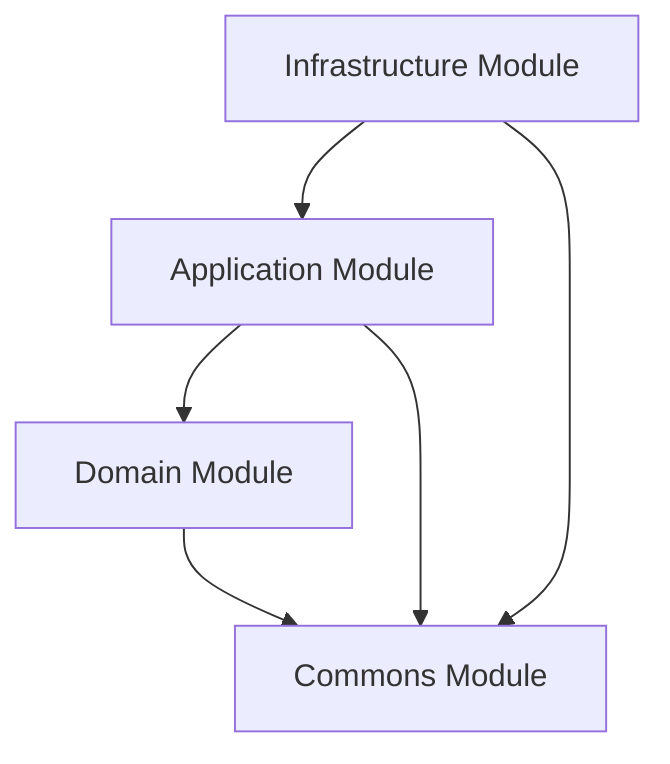
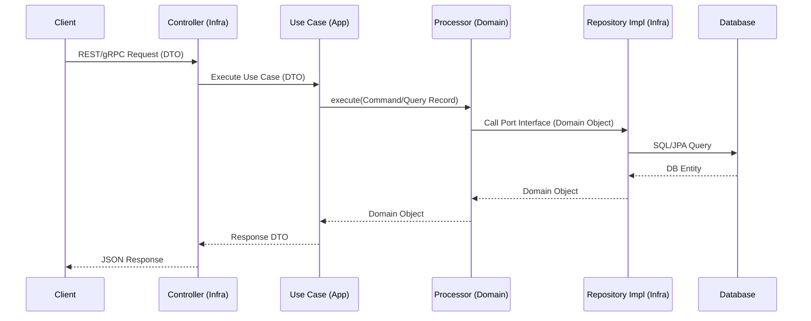

# 🚀 BCK-Plantilla: Microservices Base Template

**BCK-Plantilla** is a high-performance, production-ready base template for microservices developed by **Sysman**. It
implements a **Pragmatic Hexagonal Architecture** combined with **Domain-Driven Design (DDD)** and **CQRS (Command Query
Responsibility Segregation)** to ensure scalability, maintainability, and strict separation of concerns.

---

## 🛠️ Tech Stack

| Component         | Technology        | Version  |
|:------------------|:------------------|:---------|
| **Language**      | Java              | 25 (LTS) |
| **Framework**     | Spring Boot       | 4.0.0    |
| **Core**          | Spring Framework  | 7.0.1    |
| **Database**      | PostgreSQL        | 14+      |
| **Messaging**     | Apache Kafka      | 3.3.1    |
| **RPC**           | gRPC              | 1.63.0   |
| **Build Tool**    | Gradle            | 9.x      |
| **Documentation** | OpenAPI / Swagger | 2.7.0    |

---

## 🏗️ Architecture

The project follows a **Pragmatic Hexagonal Architecture**. The core principle is the **Dependency Rule**: dependencies
only point inwards.

### 📦 Module Structure

- **`domain`**: The heart of the software. Contains business entities, domain services, and ports (interfaces). **Zero
  external dependencies.**
- **`application`**: The orchestrator. Contains Use Cases, DTOs, and Mappers. Coordinates data flow between domain and
  infrastructure.
- **`infrastructure`**: The technical detail. Contains database adapters (JPA), external API clients, gRPC/REST
  controllers, and the `MainApplication` bootstrap.
- **`commons`**: Shared cross-cutting utilities and base classes used across the project.

### 📉 Dependency Flow



### 🔄 Request Lifecycle



---

## 🚀 Getting Started

### Prerequisites

- **JDK 25**
- **PostgreSQL**
- **Apache Kafka**
- **Spring Cloud Config Server** (Running at `http://172.17.1.161:8888`)

### Execution

Since the project uses a multi-module structure, the entry point is located in the `infrastructure` module.

**1. Compile the project:**

```bash
./gradlew clean build
```

**2. Run the application:**

```bash
./gradlew :infrastructure:bootRun
```

**3. Run tests:**

```bash
./gradlew test
```

---

## 📖 API Documentation

Once the application is running, you can access the interactive documentation:

- **Swagger UI**: [http://localhost:8081/swagger-ui.html](http://localhost:8081/swagger-ui.html)
- **OpenAPI JSON**: [http://localhost:8081/v3/api-docs](http://localhost:8081/v3/api-docs)

**Internationalization (i18n):**
Include the `Accept-Language` header in your requests:

- `es` $\rightarrow$ Spanish (Default)
- `en` $\rightarrow$ English
- `pt` $\rightarrow$ Portuguese

---

## 📚 Development Guides

For detailed technical rules and workflows, refer to the architecture documentation:

- 📘 **[Architectural Overview](./docs/architecture/overview.md)**: High-level structure and principles.
- 🤖 **[Agent Guidelines](./docs/architecture/agent-guidelines.md)**: Strict rules for AI agents maintaining this
  codebase.
- 🧪 **[Testing Strategy](./docs/architecture/testing-strategy.md)**: Standards for Unit, Integration, and Synthetic
  tests.
- ❓ **[Frequently Asked Questions](./docs/architecture/faq.md)**: Troubleshooting and architectural justifications.

---

## ⚖️ License

Distributed under the **Apache 2.0 License**.
