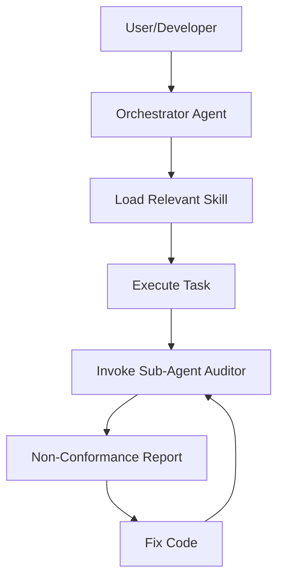

# Agent Framework Overview

This document describes the intelligent agent system implemented in the BCK-Plantilla project. The system is designed to
move beyond simple prompt-based interactions to a structured, role-based orchestration.

## 🏗️ System Architecture

The system is located in the `.agents/` directory and follows a modular structure:

### 1. Definitions (`.agents/definitions/`)

The "Brains" of the system. These are YAML files that define the **identity**, **profile**, and **main objective** of an
agent.

- **Example**: `ArchAuditAgent.yaml` defines the personality and rules of the architectural auditor.

### 2. Skills (`.agents/skills/`)

The "Know-How". Skills are specialized sets of instructions and procedures. We use **Skill Suites** to avoid
fragmentation:

- **`architecture-core`**: Hexagonal, CQRS, EDA, and Governance.
- **`architecture-design`**: UML, ArchiMate, and PlantUML diagrams.
- **`java-ecosystem`**: Spring Boot, JUnit, and Javadoc standards.
- **`dev-workflow`**: Git, PRs, and Diátaxis documentation.
- **`modern-concurrency-java25`**: Virtual Threads and Loom patterns.

### 3. The Orchestration Flow

The system operates as a multi-agent hierarchy:

## 🛠️ Governance & Quality Gate

The most critical part of this system is the **Architecture Governance**.

When a change is made to the codebase, the `architecture-governance` skill triggers the `ArchAuditAgent`. This agent
performs a strict analysis of the code, acting as a "quality gate" to prevent:

- JPA leakage into the domain.
- Incorrect dependency flow (Infrastructure $\rightarrow$ Domain).
- Technical packaging instead of Feature-based packaging.
- Event standard violations.

## 📚 Summary of Roles

| Agent/Skill           | Role        | Key Responsibility                               |
|:----------------------|:------------|:-------------------------------------------------|
| **Orchestrator**      | Manager     | Coordinates tasks and delegates to specialists.  |
| **ArchAuditAgent**    | Auditor     | Validates architectural compliance strictly.     |
| **Architecture Core** | Expert      | Guides the implementation of Hexagonal/CQRS/EDA. |
| **Java Ecosystem**    | Specialist  | Ensures Spring Boot and Testing standards.       |
| **Dev Workflow**      | Coordinator | Manages Git, PRs, and Documentation.             |
