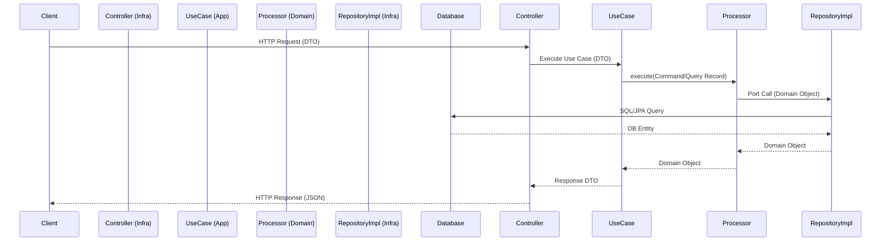

# Architectural Overview: Pragmatic Hexagonal Architecture

## 🎯 Vision

The goal of this architecture is to provide a strict separation between business logic and technical implementation
while reducing the "boilerplate explosion" typically associated with Hexagonal Architecture. We combine **Hexagonal
Architecture**, **DDD (Domain-Driven Design)**, and **CQRS (Command Query Responsibility Segregation)** in a pragmatic
way.

## 🏗️ High-Level Structure

The project is divided into four primary modules:

### 🛠️ Tech Stack

- **Java 25** (LTS)

- **Spring Boot 4.0.0**

- **Spring Framework 7.0.1**

- **Database:** PostgreSQL

- **Messaging:** Apache Kafka

- **API Documentation:** OpenAPI / Swagger

- **Build Tool:** Gradle

### 1. Domain Module (`domain`)

The **Heart of the Software**. It is a Java library with zero dependencies on other modules or external frameworks
(except for basic java utilities and Lombok to reduce boilerplate).

- **Entities:** Rich domain objects with internal validation.

- **Ports (Interfaces):** Definitions of what the domain needs from the outside (e.g., `ITypeRepository`).

- **Domain Services:** Business logic that doesn't belong to a single entity.

- **Processors (CQRS):** Specialized classes that implement a standardized lifecycle (Pre-process $\rightarrow$
  Process $\rightarrow$ Post-process) to execute Commands and Queries.

- **Commands & Queries:** Immutable records that encapsulate the intent and data of a specific business operation.

- **CQRS Templates:** Stateless base classes for Commands and Queries (located in `commons`).

### 2. Application Module (`application`)

The **Orchestrator**. It is a Java library that coordinates the flow of data between the domain and the infrastructure.

- **Use Cases:** High-level orchestrators that execute domain services and return DTOs.

- **DTOs:** Data Transfer Objects for input and output.

- **Mappers:** Conversion between Domain $\leftrightarrow$ Application DTOs.

- **BaseUseCase:** Helpers to execute processors and build `PageContext` consistently.

### 3. Infrastructure Module (`infrastructure`)

The **Technical Detail**. Implementation of ports and external interfaces.

- **Adapters:** Concrete implementations of domain ports (e.g., JPA Repositories).

- **Controllers:** REST endpoints that trigger application use cases.

- **Generic Services:** Centralized CRUD logic to avoid repetition.

- **BaseRestController:** Standard helpers for `success`, `successList`, and `paginated` responses.

- **Entities (DB):** JPA Entities that map to the database schema.

## 🗺️ Request Flow Diagram

### 4. Commons Module (`commons`)

Shared primitives used across modules (responses, i18n, CQRS templates, utilities).

## 🔌 Project Bootstrap

To avoid dependency cycles and ensure correct component scanning, the project follows these rules:

- **Entry Point:** The `MainApplication` class is located in the `infrastructure` module
  (`co.com.empresa.infrastructure`).

- **Configuration Strategy:** All technical configurations (Kafka, JPA, Async, OpenAPI, i18n) are placed in the
  `infrastructure` layer.

- **Component Scanning:** `MainApplication` uses an explicit `@ComponentScan` to include `infrastructure`,
  `application`, `domain`, and `commons` packages.

- **Dependency Flow:** All dependencies point inwards: `Infrastructure` $\rightarrow$ `Application` $\rightarrow$
  `Domain` $\rightarrow$ `Commons`.

### 🤖 Intelligent Agent Framework

The project is developed and maintained using a multi-agent system located in the `.agents/` directory. This framework
ensures that all changes adhere to the architectural standards via automated governance and specialized skills.

For more details on how the agents operate, see the **[Agent Framework Documentation](../agents/overview.md)**.

## 🔑 Core Principles

- **Dependency Rule:** Dependencies only point inwards: `Infrastructure` $\rightarrow$ `Application` $\rightarrow$
  `Domain` $\rightarrow$ `Commons`.

- **Statelessness:** All handlers and services are Spring Singletons and stateless.

- **Feature-based Packaging:** Code is organized by business feature (e.g., `/type`, `/typecategory`) rather than by
  technical layer.

- **Fail Fast:** Validation occurs at the DTO level (Application) and at the Entity level (Domain).

👉 *For deeper insights into the reasoning behind these decisions, see the **[FAQ](./faq.md)**.*

