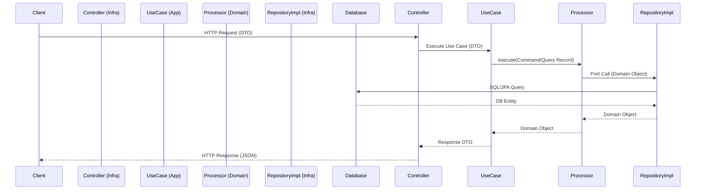

# Architectural Overview: Pragmatic Hexagonal Architecture

## 🎯 Vision

The goal of this architecture is to provide a strict separation between business logic and technical implementation
while reducing the "boilerplate explosion" typically associated with Hexagonal Architecture. We combine **Hexagonal
Architecture**, **DDD (Domain-Driven Design)**, and **CQRS (Command Query Responsibility Segregation)** in a pragmatic
way.

## 🏗️ High-Level Structure

The project is divided into four primary modules:

### 🛠️ Tech Stack

- **Java 25** (LTS)
- **Spring Boot 4.0.0**
- **Spring Framework 7.0.1**
- **Database:** PostgreSQL (Supabase compatible)
- **Messaging:** Apache Kafka (optional, conditional on `app.messaging.kafka.enabled`)
- **API Documentation:** OpenAPI 3.0 / Swagger UI
- **Build Tool:** Gradle 9.x
- **gRPC:** Netty-shaded 1.63.0

### 1. Domain Module (`domain`)

The **Heart of the Software**. A Java library with zero dependencies on Spring or JPA (except Lombok for boilerplate reduction).

- **Entities:** Rich domain objects with internal validation (`validate()`).
- **Ports (Interfaces):** Definitions of what the domain needs from the outside (e.g., `ITypeRepository`, `IEventPublisher`).
- **Domain Services:** Business logic that doesn't belong to a single entity (e.g., `TypeDomainService`, `TypeCategoryDomainService`). Annotated with `@DomainService` (pure Java marker) and auto-registered as Spring beans by `DomainServicesBeanRegistrar` in infrastructure.
- **Processors (CQRS):** Specialized classes that implement a standardized lifecycle (`preProcess` → `process` → `postProcess`).
- **Commands & Queries:** Immutable records encapsulating the intent and data of a specific operation.

### 2. Application Module (`application`)

The **Orchestrator**. Coordinates the flow of data between the domain and the infrastructure.

- **Use Cases:** High-level orchestrators (e.g., `TypeUseCase`, `TypeCategoryUseCase`) that execute domain processors and return DTOs.
- **DTOs:** `TypeRequestDto`, `TypeResponseDto`, `TypeFilterDto`, etc.
- **Mappers:** Conversion between Domain ↔ Application DTOs using MapStruct.
- **BaseUseCase:** Shared base class (`application/common/BaseUseCase.java`) providing `executeProcessor()` and `buildPageContext()` to standardize orchestration.
- **Error Handling:** `application/config/exception/ErrorHandlerConfig.java` — global `@ControllerAdvice`.

### 3. Infrastructure Module (`infrastructure`)

The **Technical Detail**. Implementation of ports and external interfaces.

- **Adapters (JPA):** Concrete implementations of domain repository ports, all extending `AbstractRepositoryImpl<M,E,K>` to eliminate per-feature boilerplate.
- **Controllers:** REST endpoints that delegate to application use cases.
- **BaseRestController:** (`infrastructure/common/BaseRestController.java`) — provides `success()`, `successList()`, `paginated()` helpers to all controllers.
- **Generic Services:** `GenericServiceImpl` provides standard CRUD + dynamic filtering + pagination.
- **Entities (DB):** JPA Entities mapping to the database schema.
- **Dual Datasource:** Separate `CommandJpaConfig` and `QueryJpaConfig` with independent Hikari pools. JPA repos extend `IJpaCommandRepository` or `IJpaQueryRepository` to document the binding explicitly.
- **Event Audit:** `EventAuditServiceImpl` + `KafkaEventListenerAspect` for idempotent Kafka consumption.
- **Domain Bean Auto-Registration:** `@DomainService` is meta-annotated with `@Component`, so Spring's component scanning auto-detects all domain services — no manual config needed.

### 4. Commons Module (`commons`)

**Shared primitives** used across all modules with no business-specific knowledge.

- **CQRS Templates:** `CommandProcessAbstract`, `QueryAbstract`, `PaginatedQueryAbstract`, `ComboQueryAbstract` (in `commons/cqrs/`).
- **Response Builder:** `ApiResponseBuilder` + `GenericResponse<T>`.
- **Exceptions:** `DomainException`, `ApplicationException`, `InfrastructureException`.
- **i18n:** `MessageService`, `MessageKeys` constants.
- **Utilities:** `PaginationHelper`, `DateUtilities`, `ObjectUtilities`, `Cripto`, `Base64TokenService`.
- **Interfaces:** `IGenericService`, `IRepository`, `ICommandRepository`, `IQueryRepository`, `IAuditable`.

## 🗺️ Request Flow Diagram

## 🔌 Project Bootstrap

To avoid dependency cycles and ensure correct component scanning:

- **Entry Point:** `MainApplication` is located in the `infrastructure` module (`co.com.empresa.infrastructure`).
- **Configuration Strategy:** All technical configurations (Kafka, JPA, Async, OpenAPI, i18n) are placed in `infrastructure`.
- **Component Scanning:** `MainApplication` uses explicit `@ComponentScan` to include `infrastructure`, `application`, `domain`, and `commons` packages.
- **Dependency Flow:** `Infrastructure` → `Application` → `Domain` → `Commons`.

### 🤖 Intelligent Agent Framework

The project uses a multi-agent system in `.agents/` to ensure architectural compliance. For details, see **[Agent Framework Documentation](../agents/overview.md)**.

## 🔑 Core Principles

- **Dependency Rule:** Dependencies only point inwards: `Infrastructure` → `Application` → `Domain` → `Commons`.
- **Statelessness:** All handlers and services are Spring Singletons and stateless.
- **Feature-based Packaging:** Code is organized by business feature (e.g., `/type`, `/typecategory`, `/event`) rather than by technical layer.
- **Fail Fast:** Validation occurs at the DTO level (Application) and at the Domain Entity level.
- **Domain Purity:** Domain module has zero Spring/JPA runtime annotations. `@DomainService` is a pure Java marker; Spring bean registration is handled exclusively by `DomainServicesBeanRegistrar` in infrastructure.

👉 *For deeper insights into the reasoning behind these decisions, see the **[FAQ](./faq.md)**.*
